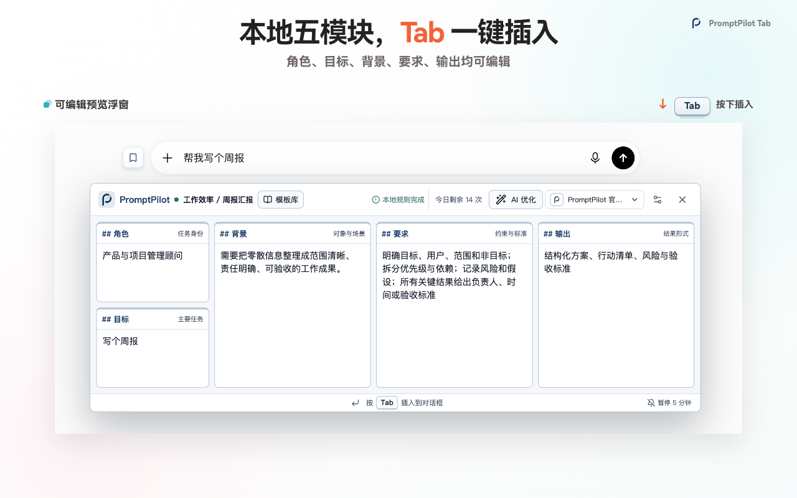
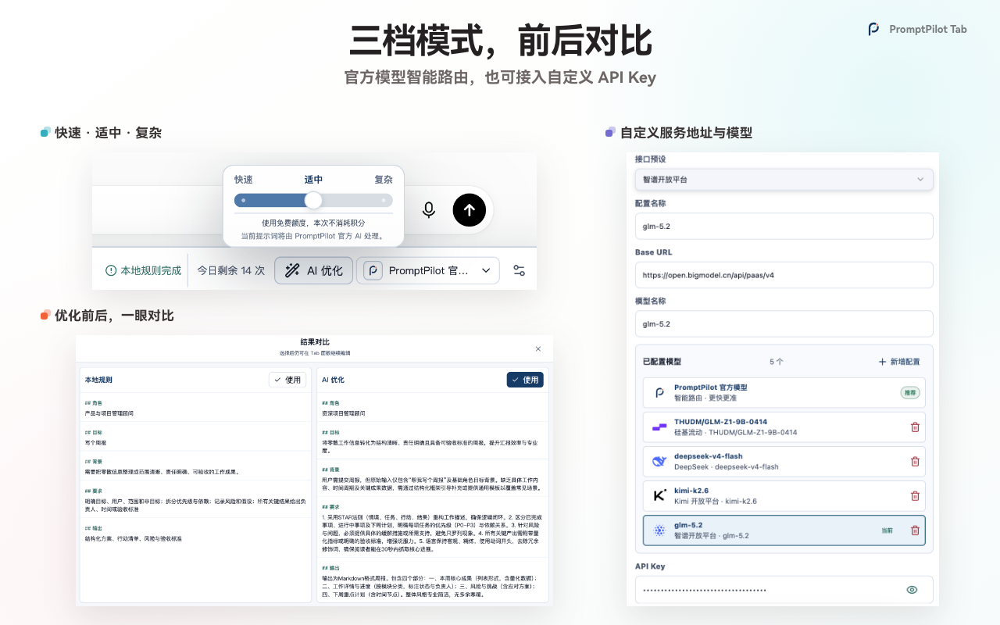
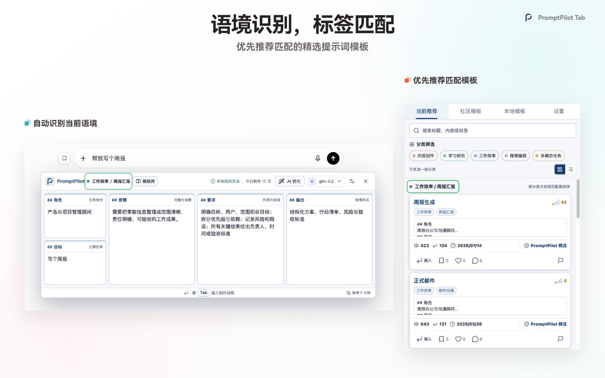
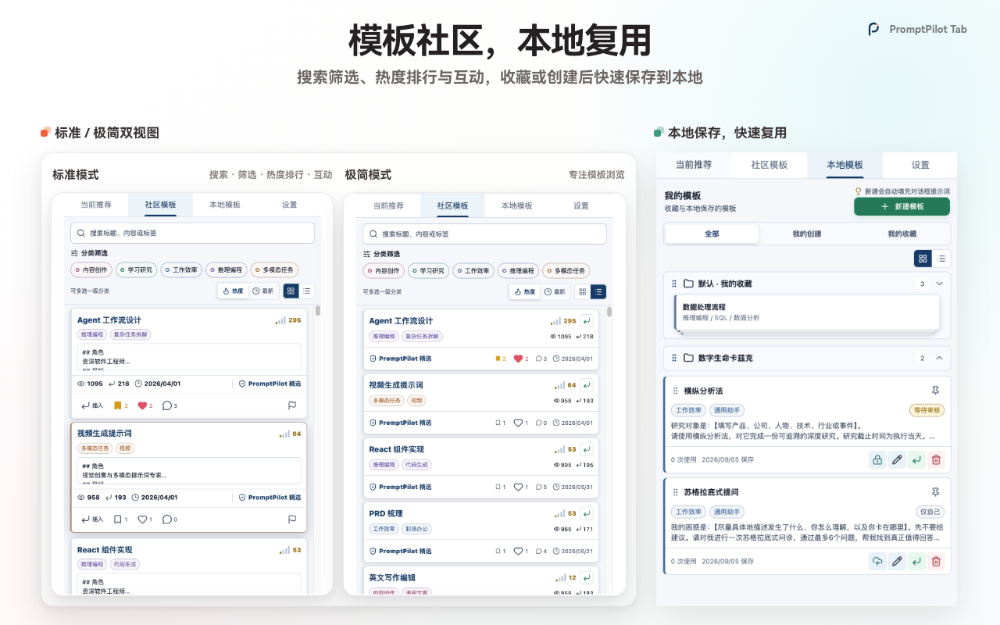
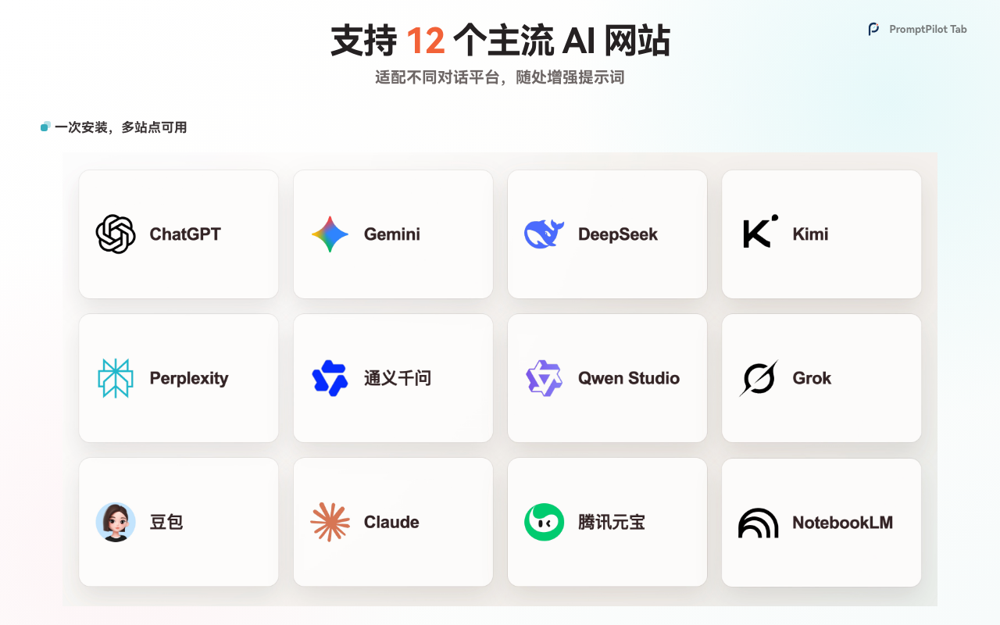
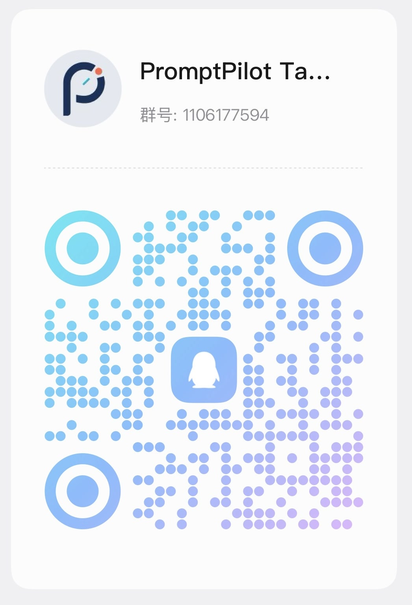

# PromptPilot Tab

<p align="center">
  <a href="https://www.youtube.com/watch?v=gl7XjzoNPHM">
    
  </a>
</p>

<p align="center">
  <strong>Turn rough ideas into clear, editable prompts that are ready to use.</strong>
</p>

<p align="center">
  <a href="https://promptpilot-tab.com">Website（官方网站）</a> ·
  <a href="https://www.youtube.com/watch?v=gl7XjzoNPHM">56-second demo（产品演示）</a> ·
  <a href="https://github.com/Saul1382/promptpilot-tab/discussions">Discussions（交流与问答）</a> ·
  <a href="https://github.com/Saul1382/promptpilot-tab/issues/new/choose">Issues（问题反馈）</a> ·
  <a href="README.md">简体中文</a>
</p>

PromptPilot Tab is a browser prompt enhancement tool（浏览器提示词增强工具） for leading artificial intelligence chat sites（人工智能对话网站）. Write an idea, review and edit a five-part preview—role, goal, context, requirements, and output—then press `Tab` to insert it into the current conversation. It never sends the message for you.

```text
Write an idea → Review five sections → Edit if needed → Optional AI optimization → Press Tab
```

## See the real workflow

Select the hero above to watch the full [YouTube product demo（YouTube 产品演示）](https://www.youtube.com/watch?v=gl7XjzoNPHM).

### Generate locally, edit before inserting

The core local workflow（本地工作流） needs no account or model configuration. Every section remains editable until you choose to insert it.



### Choose AI optimization when you need it

Select fast, balanced, or complex mode and compare results before applying them. Bring Your Own Key（用户自带密钥，BYOK） credentials stay in the current browser.



### Find more relevant templates

PromptPilot Tab detects the task category and tags, then prioritizes templates by relevance（匹配度）.



### Use community and local libraries

Browse, search, and save community templates（社区模板）, or keep your own reusable prompts in the local library（本地模板库）.



### Work across 12 leading AI chat sites

Use the same preview-and-insert flow in ChatGPT, Claude, Gemini, DeepSeek, Kimi, Qwen, Yuanbao, Doubao, Grok, Perplexity, NotebookLM, and Google AI Studio.



## Availability（获取方式）

The Chrome Web Store listing（Chrome 扩展商店页面） is being prepared for review. The official installation link will appear on the [website](https://promptpilot-tab.com) and in this repository after approval. Until then, please do not install packages from unofficial sources.

Star this repository to follow launch updates, or join the conversation in [GitHub Discussions（GitHub 讨论区）](https://github.com/Saul1382/promptpilot-tab/discussions).

## Privacy and control（隐私与控制）

- The core local workflow works offline and does not require an account.
- AI optimization runs only after the user explicitly requests it.
- You can inspect and edit every result before insertion; PromptPilot Tab never sends a message for you.
- Bring Your Own Key（用户自带密钥，BYOK） settings and Application Programming Interface Keys（应用程序编程接口密钥，API Keys） remain in the current browser.

Read the full [privacy policy（隐私政策）](https://promptpilot-tab.com/privacy).

## Community and support（交流与支持）

- Questions, workflows, and open conversation: [GitHub Discussions（GitHub 讨论区）](https://github.com/Saul1382/promptpilot-tab/discussions)
- Reproducible bugs and feature requests: [GitHub Issues（GitHub 问题追踪）](https://github.com/Saul1382/promptpilot-tab/issues/new/choose)
- International community: [Discord](https://discord.gg/WEKBT36Q8U)
- QQ group（QQ 交流群）: `1106177594`
- Xiaohongshu account（小红书账号）: `517411810`
- Support email（支持邮箱）: [support@promptpilot-tab.com](mailto:support@promptpilot-tab.com)

<p>
  
  
</p>

Remove prompts, account details, email addresses, API Keys, and other private information before posting publicly. Report security issues privately through the support email.

## About this repository（关于本仓库）

This is the public product showcase and community repository（公开产品展示与社区仓库） for PromptPilot Tab. It does not contain product source code and does not accept source-code Pull Requests（拉取请求，PR）. The private development repository is completely separate.

Public visibility is not an open-source license. All rights to the brand, copy, screenshots, videos, and other media are reserved; see [NOTICE](NOTICE.md).
